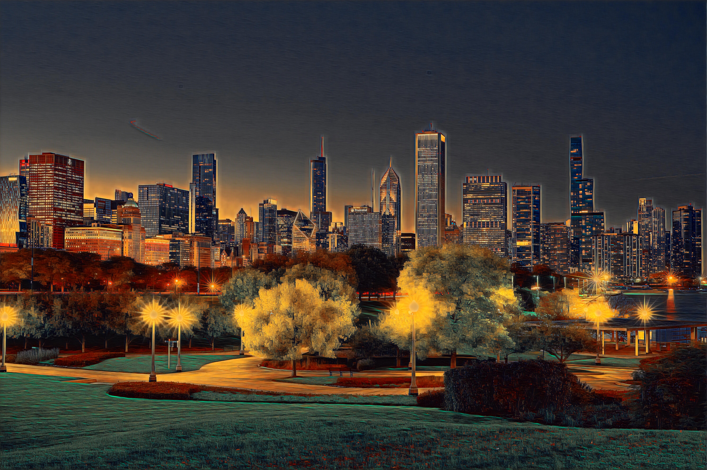
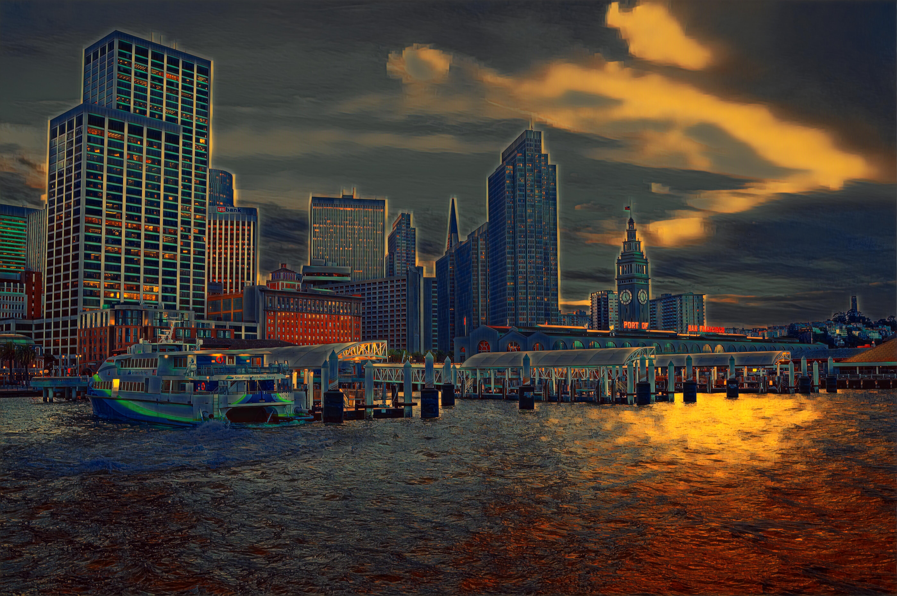
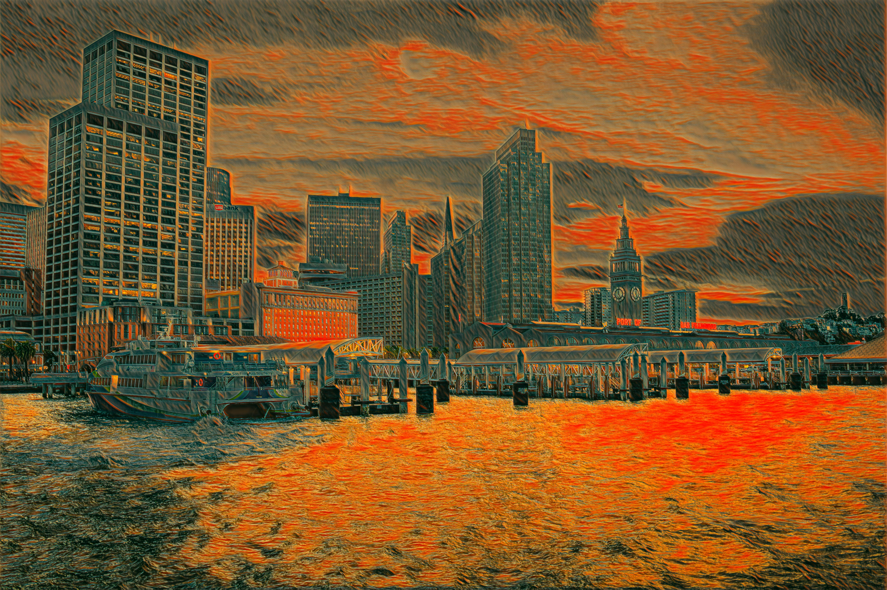
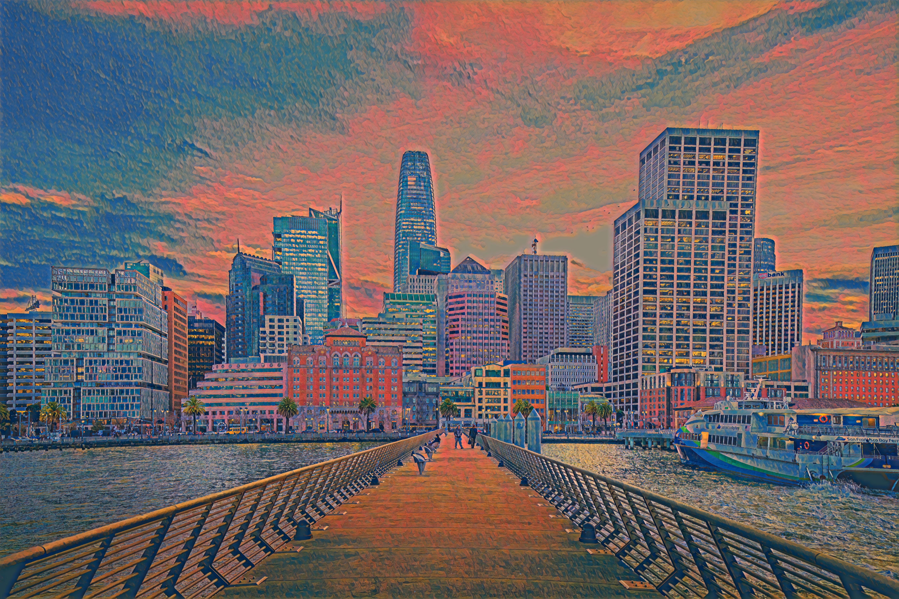
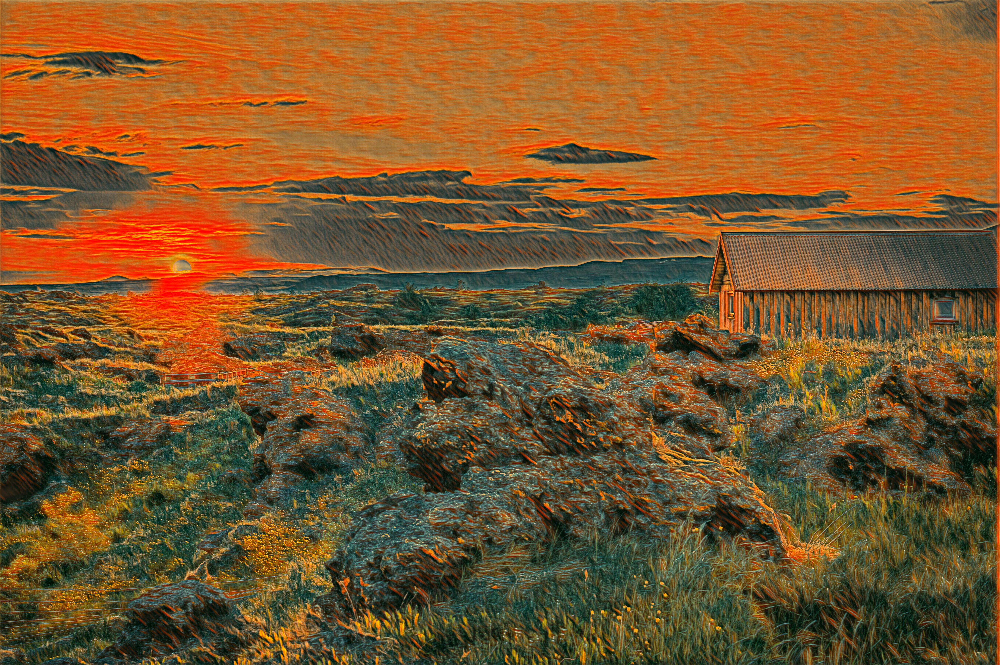

# Fast Neural Style Transfer

This repository contains a PyTorch implementation of fast neural style transfer based on Johnson's method, allowing you to apply artistic styles to images in real-time once a model is trained.



## Overview

Neural style transfer is a technique that allows you to recompose images in the style of other images. This implementation is based on the approach outlined in the paper [Perceptual Losses for Real-Time Style Transfer and Super-Resolution](https://arxiv.org/abs/1603.08155) by Justin Johnson, Alexandre Alahi, and Li Fei-Fei.

Unlike the original optimization-based neural style transfer methods, this implementation uses a feed-forward neural network that is trained to solve the stylization problem directly. Once trained on a specific style, the model can stylize any content image in real-time.

## Features

- Fast style transfer using pre-trained models
- Training interface to create new style transfer models
- Google Colab integration for easy use with GPU acceleration
- Support for high-resolution image generation
- Visualization of training losses and results

## Requirements

- Python 3.6+
- PyTorch 1.7+
- torchvision
- PIL (Pillow)
- matplotlib
- Google Colab (optional, for training)

## Usage

### Setting up in Google Colab

1. Upload the notebook to Google Drive
2. Create the following directory structure in your Google Drive:
```
collab_notebooks/fast_transfer_project/
├── data/
│   ├── content-images/     # Training dataset images
│   ├── style-images/       # Style reference images
│   ├── models/             # Saved trained models
│   ├── checkpoints/        # For saving training checkpoints
├── output/                 # For storing generated images
```

3. Mount your Google Drive in Colab:
```python
from google.colab import drive
drive.mount('/content/drive')
```

### Training a New Style Transfer Model

To train a new style transfer model:

1. Place your training images in the `content-images` directory
2. Place your style reference image in the `style-images` directory
3. Run the training cell with the appropriate parameters:

```python
dataset_path = "/content/drive/MyDrive/collab_notebooks/fast_transfer_project/data/content-images"
style_image_path = "/content/drive/MyDrive/collab_notebooks/fast_transfer_project/data/style-images/your_style_image.jpg"
model_output_path = "/content/drive/MyDrive/collab_notebooks/fast_transfer_project/data/models/your_model_name.pth"

content_losses, style_losses, total_losses = train_style_transfer(
    dataset_path,
    style_image_path,
    model_output_path,
    epochs=10,       # Increase for better results
    batch_size=4,    # Decrease if you have memory issues
    image_size=256,  # Size of training images
    content_weight=5e4,
    style_weight=1e10,
    lr=1e-3
)
```

### Training Visualization

During training, the model simultaneously minimizes content and style losses. The notebook will display loss curves showing how these values change over epochs, helping you monitor the training progress and determine when the model has converged.

### Applying Style to New Images

To apply a trained style model to a new image:

```python
content_image_path = "/path/to/your/content/image.jpg"
model_path = "/path/to/your/trained/model.pth"
output_path = "/path/to/save/stylized/output.jpg"

stylize_and_compare(model_path, content_image_path, output_path)
```

## Training Dataset

This implementation is designed to be trained on a large dataset of images. The [COCO dataset](https://cocodataset.org/) is recommended for training, as it contains a diverse range of images that help the model generalize well.

You can download the COCO dataset from:
- [COCO 2017 Train Images](http://images.cocodataset.org/zips/train2017.zip) (~18GB)
- [COCO 2014 Train Images](http://images.cocodataset.org/zips/train2014.zip) (~13GB)

For faster experimentation, you can also use a smaller subset of images.

## Pre-trained Models

This repository includes pre-trained models for various artistic styles that can be used without training. These models were trained on the COCO dataset and can be applied directly to new content images.

### Style Gallery

Below is a gallery showing different style models applied to similar scenes:

<div align="center">
  <table>
    <tr>
      <td></td>
      <td></td>
      <td></td>
    </tr>
    <tr>
      <td>Edward Hopper Style</td>
      <td>The Scream Style</td>
      <td>Gauguin Style</td>
    </tr>
  </table>
</div>

<div align="center">
  <table>
    <tr>
      <td></td>
      <td></td>
      <td></td>
    </tr>
    <tr>
      <td>Kandinsky Style</td>
      <td>The Scream Style</td>
      <td>Edward Hopper Style</td>
    </tr>
  </table>
</div>

## Method

The implementation follows the approach described by Johnson et al., using:

1. A transformer network based on the architecture proposed in the paper
2. A pre-trained VGG-16 network to compute perceptual losses
3. Two loss components:
   - Content loss: Ensures the content of the original image is preserved
   - Style loss: Ensures the style of the reference image is transferred

The transformer network is trained to minimize both losses simultaneously, creating a balance between content preservation and style transfer.

### Style Transfer Process

The style transfer process transforms a content image into the style of a reference artwork while preserving the original content

## Acknowledgements

This implementation is based on:

- [Perceptual Losses for Real-Time Style Transfer and Super-Resolution](https://arxiv.org/abs/1603.08155) by Johnson et al.
- The original Lua implementation by Justin Johnson: [fast-neural-style](https://github.com/jcjohnson/fast-neural-style)

Note: The original Lua implementation used Torch libraries that are no longer maintained. This PyTorch reimplementation provides similar functionality with modern deep learning frameworks.

## Citation

If you use this code for your research, please cite:

```
@article{Johnson2016Perceptual,
  title={Perceptual losses for real-time style transfer and super-resolution},
  author={Johnson, Justin and Alahi, Alexandre and Fei-Fei, Li},
  journal={European Conference on Computer Vision},
  year={2016}
}
```

## License

MIT License
